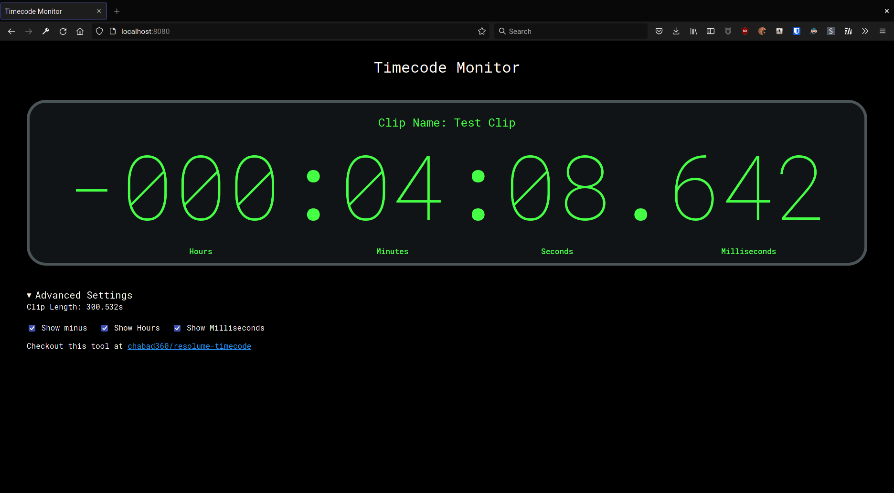
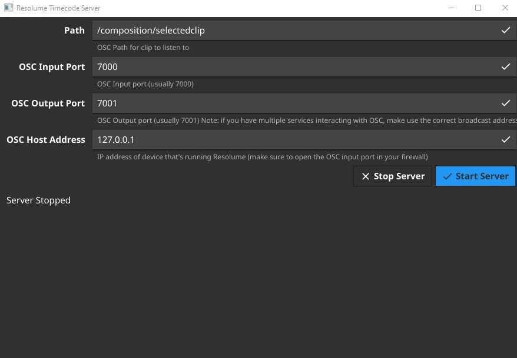

   
  <h2>Resolume Timecode Monitor</h2>
  
View the time left for a playing clip on multiple devices.

|  |  |
|:-----------------------------------------------------:|:-------------------------------------------------------:|
|                _The client interface._                |               _The server end of things._               |

## How to use

1. Download the [latest release](https://github.com/chabad360/resolume-timecode/releases)
2. Open the app and verify that all the information in there is set correctly.
3. Click _Start Server_
4. Open your web browser to the location specified by the application.
5. Start playing a clip in Resolume.
6. Profit.

> Note: The precision should be within a few hundred milliseconds (usually 50ms), if it feels off double check that the clip length 
(in the status bar on the bottom) is correct. If it isn't, just click the reset button.

### How to set the `Path` field

| Clip to use    | Example path                    |
|:---------------|:--------------------------------|
| Selected Clip  | `/composition/selectedclip`     |
| Specific Clip  | `/composition/layers/1/clips/1` |
| Selected Layer | `/composition/selectedlayer`    |
| Specific Layer | `/composition/layers/1`         |

> Note: using a layer will cause the layer's name to be shown on the client instead of the clip name
> (I'm not sure if there is a way to fix that).

## Motivation

When using Resolume for events where longer clips were being played, I found it annoying that the only way to find out
the remaining time was to ask the guy in front of the laptop. So I decided to fix that.

## How it works

Resolume outputs the position of the clip head through OSC, by calculating how much time it took between the one message
and the previous one, it's possible to calculate how long the clip is, and therefore how much time is left.
Due to certain inconsistencies in the way this information is outputted, it's not as simple as it sounds.

For the exact algorithm, check [procmessage.go](https://github.com/chabad360/resolume-timecode/blob/master/procmessage.go) 
(specifically, [`procPos()`](https://github.com/chabad360/resolume-timecode/blob/master/procmessage.go#L97)).

Anyway, because we're running in a browser, we can't actually interact with OSC (as it works over UDP),
so this application also acts a proxy, running the algorithm on the messages and sending the timecode to the client.

## Known Issues

- Uses around 60-70mb of RAM. Sorry, can't do much about that, at least it's better than an electron app.

## Building

Because this is based on [fyne](https://fyne.io) it requires the use of _cgo_, so make sure you have a C compiler installed on your system.

Just clone the repo and run `go build github.com/chabad360/resolume-timecode`.
