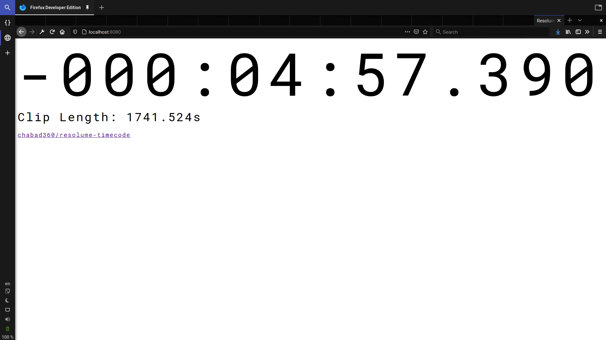
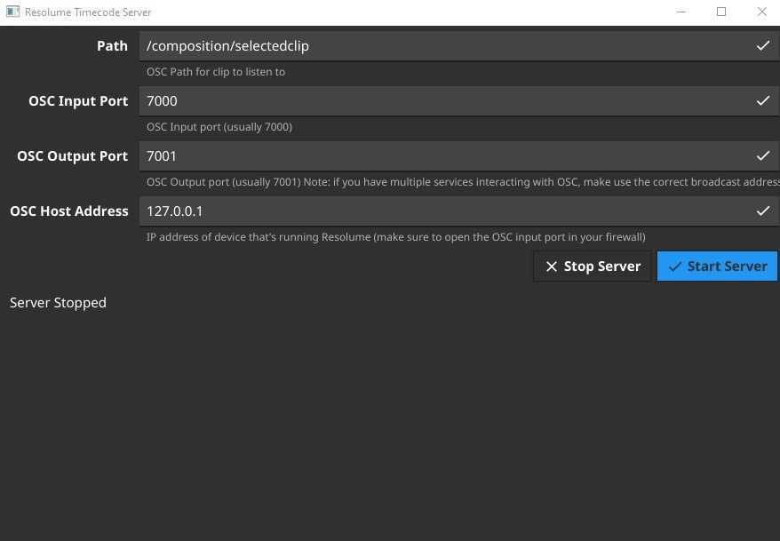

# Resolume Timecode Monitor

View the time left for a playing clip on multiple devices.

_This screenshot is from firefox on linux, but you can even view this on your phone._

_This is the server end of things, doesn't need to be run on the same device as Resolume_

## How to use

1. Open _resolume-timecode.exe_ and make sure that all the information in there is set correctly.
2. Click _Start Server_
3. Open your web browser to `http://localhost:8080` (or the IP of the device that's running this app plus `:8080`).
4. Start playing a clip in Resolume.
5. Profit.

## Motivation

When using Resolume for events where longer clips were being played, I found it annoying that the only way to find out
the remaining time was to ask the guy in front of the laptop. So I decided to fix that.

## How it works

Resolume outputs the position of the clip head through OSC, by calculating how much time it took between the one message
and the previous one, it's possible to calculate how long the clip is, and therefore how much time is left.
Due to certain inconsistencies in the way this information is outputted, it's not as simple as it sounds.

For the exact algorithm, check [main.js](https://github.com/chabad360/resolume-timecode/blob/master/main.js).

## Known Issues

- Playing a clip backwards just doesn't work. This is because of the way certain math is done, there is a relatively simple fix
  I just haven't gotten to implementing it yet.
- If a clip loops, the counter will stop. This is because I haven't yet figured out a good way to determine that a clip has looped,
  without causing other issues.
- Uses 60mb of RAM. Sorry, can't do much about that, at least it's better than a electron app.  

## Building

Because this is based on [fyne](https://fyne.io) it requires the use of _cgo_, so make sure you have some CC installed on your system.

Just clone the repo and run `go build github.com/chabad360/resolume-timecode`.